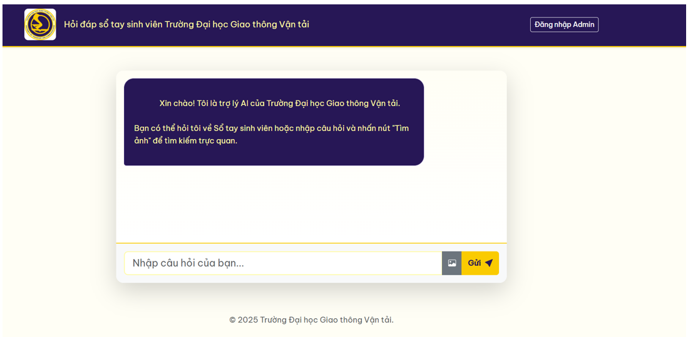

# 🎓 UTC Student Handbook Assistant (AI Chatbot)

An intelligent assistant designed to help students of the University of Transport and Communications (UTC) quickly find information from the **Student Handbook**. 

Unlike traditional keyword search, this system uses **RAG (Retrieval-Augmented Generation)** to understand natural language questions and **Multimodal Retrieval** to find relevant charts, diagrams, and images within the documents.

 

## 🚀 Key Features

* **🤖 Smart Text Q&A:** Ask questions about university regulations, scholarships, or curriculum in natural Vietnamese. The system uses **Google Gemini** (via LangChain) to generate accurate answers based on the handbook.
* **📅 Time-Aware Reranking:** The system automatically prioritizes the **latest regulations**. If a new PDF is uploaded, the chatbot prioritizes the new rules over the old ones using a custom "Rerank by Date" algorithm.
* **🖼️ Semantic Image Search:** Find flowcharts, diagrams, or tables by describing them (e.g., "Scholarship flowchart"). Powered by the **Vintern-1B** multimodal model.
* **📂 Admin Dashboard:** A secure interface for administrators to upload new PDF documents and update the knowledge base without restarting the system.
* **💬 Context-Aware Memory:** The chatbot remembers the conversation history, allowing for follow-up questions.

## 🛠️ Tech Stack

* **Language:** Python 3.10+
* **Framework:** Flask (Web Backend)
* **LLM (Chat):** Google Gemini (`gemini-2.5-flash`)
* **Orchestration:** LangChain
* **Vector Database:** ChromaDB (Local persistence)
* **Embeddings:** * *Text:* `bkai-foundation-models/vietnamese-bi-encoder`
    * *Image:* `5CD-AI/Vintern-Embedding-1B`
* **Frontend:** HTML5, CSS3, Bootstrap 5, Vanilla JavaScript.

## ⚙️ How It Works

1.  **Data Ingestion:** The Admin uploads a PDF. The system splits the text into chunks and extracts images.
2.  **Indexing:** Text chunks are vectorized and stored in **ChromaDB**. Images are processed by **Vintern-1B** and indexed in memory.
3.  **Retrieval (RAG):** * When a user asks a question, the system retrieves the top relevant documents.
    * It **reranks** them to ensure the most recent information is used.
    * **Gemini** generates the final answer with citations (Source file & Page number).

## 📥 Installation & Setup

1.  **Clone the repository**
    ```bash
    git clone https://github.com/VanDung104/CDCNTT.git
    cd utc-assistant
    ```

2.  **Create a virtual environment**
    ```bash
    python -m venv venv
    source venv/bin/activate  # On Windows: venv\Scripts\activate
    ```

3.  **Install dependencies**
    ```bash
    pip install -r requirements.txt
    ```

4.  **Configure Environment Variables**
    Create a `.env` file in the root directory and add your keys:
    ```env
    GOOGLE_API_KEY=your_google_gemini_key
    ADMIN_USERNAME=admin
    ADMIN_PASSWORD=your_password
    FLASK_SECRET_KEY=your_secret_key
    ```

5.  **Run the Application**
    ```bash
    python app3.py
    ```
    Access the app at `http://localhost:5000`.

## ⚠️ Limitations

* **Image Update:** Currently, image indexing is pre-computed. When uploading a new PDF, the text updates immediately, but the image search requires a server restart to load new image vectors into RAM (due to the large size of the Vintern-1B model on CPU).

## 🤝 Acknowledgements

* **LangChain** for the RAG framework.
* **Google Gemini** for the LLM API.
* **BKAI** and **5CD-AI** for the Vietnamese embedding models.

---
*Created by Chu Van Dung - UTC Student*
